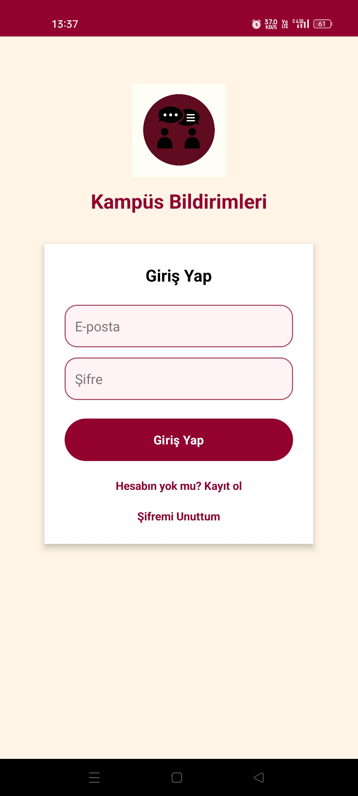
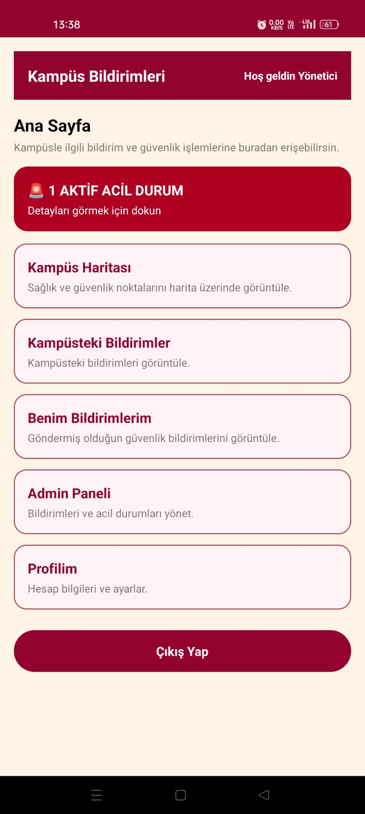
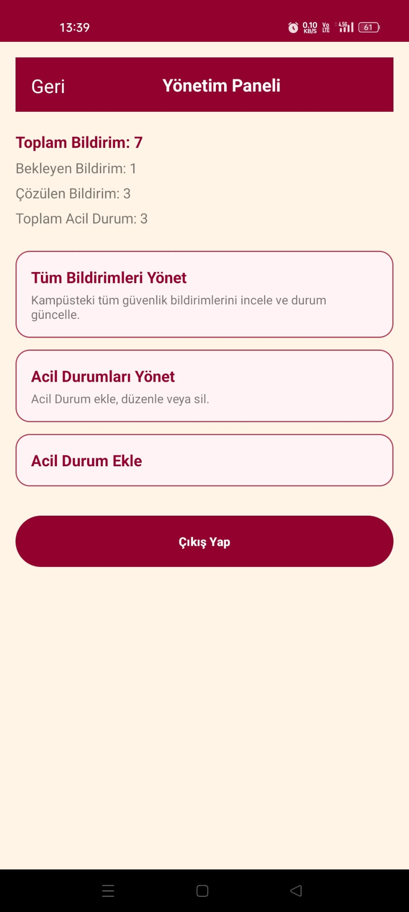
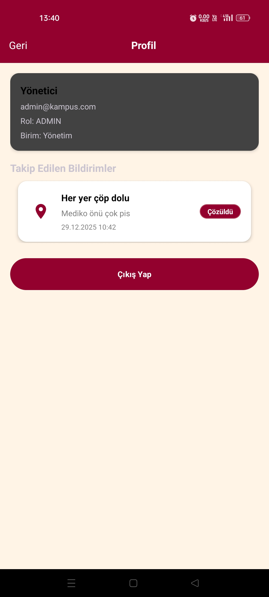
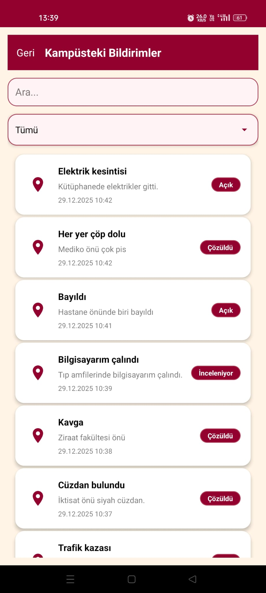
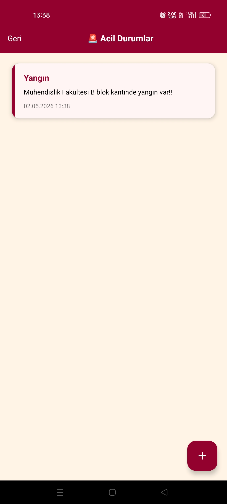

# 📱 Akıllı Kampüs Bildirim Uygulaması


---

## 📌 Proje Hakkında

Bu proje, kampüs içerisinde meydana gelen sağlık, güvenlik, çevre, kayıp-buluntu ve teknik arıza gibi olayların kullanıcılar tarafından hızlı bir şekilde raporlanmasını, harita üzerinde görüntülenmesini ve yönetilmesini sağlayan Android tabanlı bir mobil uygulamadır.

Kullanıcılar uygulama üzerinden olay bildirimi oluşturabilir, mevcut bildirimleri inceleyebilir ve takip edebilir. Yönetici rolü ise bu bildirimleri yönetir, durumlarını günceller ve gerekli durumlarda acil duyurular yayınlayabilir.

---

## 🎯 Amaç

* Kampüs içi olayların hızlı ve merkezi bir sistem üzerinden yönetilmesini sağlamak
* Kullanıcılar arasında bilgi paylaşımını kolaylaştırmak
* Acil durumların hızlı şekilde iletilmesini sağlamak
* Konum tabanlı bildirim sistemi geliştirmek
* Gerçek dünya problemlerine yönelik mobil uygulama geliştirmek

---

## 👥 Kullanıcı Rolleri

### 👤 Kullanıcı (User)

* Olay bildirimi oluşturabilir
* Bildirimleri listeleyebilir
* Bildirimleri filtreleyebilir ve arayabilir
* Harita üzerinden bildirimleri inceleyebilir
* Bildirim detaylarını görüntüleyebilir
* Bildirimleri takip edebilir / takibi bırakabilir
* Durum değişikliklerinde bildirim alır
* Profil ve ayarlarını yönetebilir

---

### 🧑‍💼 Yönetici (Admin)

* Tüm bildirimleri görüntüler
* Bildirim durumlarını günceller
* Bildirim açıklamalarını düzenleyebilir
* Uygunsuz bildirimleri sonlandırabilir
* Acil durum bildirimi yayınlayabilir

---

## 🚀 Uygulama Özellikleri

### 🔐 Giriş ve Kayıt Sistemi

* E-posta ve şifre ile giriş
* Kullanıcı kaydı oluşturma
* Rol bazlı yönlendirme
* Şifre sıfırlama ekranı

---

### 🏠 Ana Sayfa – Bildirim Akışı

* Bildirim listesi (başlık, açıklama, tarih, durum)
* Tür bazlı filtreleme
* Takip edilen bildirimleri görüntüleme
* Arama özelliği

---

### 📍 Harita Ekranı

* Google Maps entegrasyonu
* Bildirimlerin pin ile gösterimi
* Tür bazlı ikonlar
* Detay ekranına yönlendirme

---

### 📄 Bildirim Detay Ekranı

* Başlık, açıklama, tür, tarih
* Konum bilgisi
* Fotoğraf desteği
* Takip et / bırak
* Admin için durum güncelleme

---

### ➕ Yeni Bildirim Oluşturma

* Tür seçimi
* Başlık ve açıklama
* Konum seçimi (harita / cihaz)
* Fotoğraf ekleme
* Form doğrulama

---

### ⚙️ Admin Paneli

* Tüm bildirimleri listeleme
* Kullanıcı bilgilerini görüntüleme
* Bildirim durumlarını güncelleme
* Acil durum bildirimi oluşturma

---

### 👤 Profil ve Ayarlar

* Kullanıcı bilgilerini görüntüleme
* Takip edilen bildirimleri listeleme
* Çıkış yapma

---

### 🔔 Bildirim Sistemi

* Takip edilen bildirimlerde durum değişikliği bildirimi
* Admin tarafından gönderilen acil bildirimler

---

## 🧠 Mimari Yapı

Uygulama katmanlı mimari yaklaşımı ile geliştirilmiştir.

### 📐 Katmanlar

* UI Layer (Activity + XML)
* Business Logic Layer
* Data Layer (SQLite)

### 🧩 Bileşenler

* Activities → Uygulama ekranları
* Adapters → Listeleme işlemleri
* Models → Veri yapıları
* Helpers → DatabaseHelper, SessionManager, NotificationHelper

---

## 🗄️ Veritabanı

* SQLite lokal veritabanı kullanılmıştır

* Tablolar:

  * Users
  * Reports
  * Announcements
  * Followers

* Tüm veri işlemleri `DatabaseHelper` sınıfı üzerinden yönetilmektedir

---

## 🖼️ Uygulama Ekran Görüntüleri

### 🔐 Giriş Ekranı



### 🏠 Ana Sayfa



### ⚙️ Admin Paneli



### 👤 Profil



### 📋 Bildirimler



### 🚨 Acil Durumlar



---

## 🛠️ Kullanılan Teknolojiler

* Java (Android Development)
* Android SDK
* SQLite
* Google Maps API
* XML Layout
* SharedPreferences

---

## ⚙️ Kurulum

```bash
git clone https://github.com/EmirSafa0/Campus-Notification-Mobile-App.git
```

1. Android Studio ile projeyi aç
2. Gradle senkronizasyonunu bekle
3. Emulator veya cihaz seç
4. Uygulamayı çalıştır

---

## ⚠️ Notlar

* Google Maps API key güvenlik nedeniyle repoda bulunmamaktadır
* Uygulama lokal veritabanı ile çalışmaktadır
* Proje tamamen çalışır durumdadır

---

## 👨‍💻 Geliştirici

**Emir Safa Kaymakçı**

---

## 📄 Lisans

Bu proje MIT Lisansı ile lisanslanmıştır.
